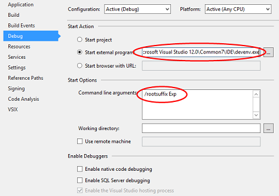
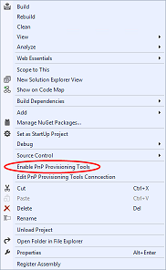
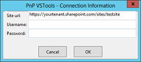
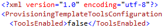

# Provisioning.VSTools #

### Summary ###
This sample demonstrates using the PnP provisioning engine within a Visual Studio extension package to assist with common deployment tasks for SharePoint assets.  The VSTools extension package maintains the PnP provisioning engine XML file automatically as files are added or removed from the project instead of the developer having to fill out the file manually which usually results in missing items, misspelled items, etc.  In addition to the XML file, the extension package also provides some useful developer shortcuts such as right-click to quickly deploy a file (rather than all items in the XML file) and right-click to quickly deploy the entire provisioning template.  The PnP provisioning engine XML file is fully supported (ie: content types, site columns, etc.) and deployable, however the extension package only maintains file references within this XML file at this time. 

### Applies to ###
-  Office 365 Multi Tenant (MT)
-  Office 365 Dedicated (D)

### Prerequisites ###
Visual Studio SDK – this is a beta version of the extension package and requires the SDK to properly install.
Note: extension packages require referenced assemblies to be signed… the PnP assemblies aren’t signed so to use them in an extension package, the latest PnP Provisioning engine was downloaded, compiled, and signed.  This is important because the extension package will not auto-update if a new version of the provisioning engine is released.

### Solution ###
Solution | Author(s)
---------|----------
Provisioning.VSTools | Jerry Fetzer (Perficient, Inc.) <br>Tatjana Starovoitva (Perficient, Inc.)<br>Camille Mercado (Perficient, Inc.)<br>Michael Toole (Perficient, Inc.)


### Version history ###
Version  | Date | Comments
---------| -----| --------
0.5  | November 10th 2015| Initial beta release
0.6  | May 25th 2016| Updated nuget packages, including the PnP Core package

### Disclaimer ###
**THIS CODE IS PROVIDED *AS IS* WITHOUT WARRANTY OF ANY KIND, EITHER EXPRESS OR IMPLIED, INCLUDING ANY IMPLIED WARRANTIES OF FITNESS FOR A PARTICULAR PURPOSE, MERCHANTABILITY, OR NON-INFRINGEMENT.**


----------
# Debugging the extension package #
To debug the extension package, some debug options need to be set on the project.
1) Load the project in Visual Studio
2) restore all nuget packages and ensure the project builds
3) Navigate to project properties > debug
4) Select 'start external program' and set the path to your copy of visual studio (devenv.exe)
5) Set "Start Options" to: /rootsuffix Exp
6) Press F5 or click 'Start'



# Installing the extension package (instead of debugging it) #
To install the extension package, either a setup project is needed to create an MSI file or the VSIX file from the extension project itself can be used.  The VSIX can also be hosted on a private extension gallery to help maintain the deployments to multiple users and machines.

The process of hosting in a private gallery is described in the following blog post http://blogs.msdn.com/b/visualstudio/archive/2011/10/03/private-extension-galleries-for-the-enterprise.aspx (note: the post references Visual Studio 2010, but the same process is used for new versions of Visual Studio).

In addition to the steps outlined in the blog post above, the web.config file of the gallery website needs to be modified to add the following MIME map for the VSIX file extension:
```XML
  <system.webServer>
    <staticContent>
      <mimeMap fileExtension=".vsix" mimeType="application/octet-stream" />
    </staticContent>
  </system.webServer> 
```

Private galleries are managed via the Extensions and Tools menu.  Once the VSIX package is available in the private gallery, users can choose to install/uninstall as needed.

# Enabling the PnP Provisioning Tools Extension #
Once installed, the extension functionality can be turned on or off by right-clicking your project and selecting Enable PnP Provisioning Tools.



The first time this is done, the user will be prompted to enter the connection credentials and target site url.  This dialog can also be found by clicking the "Edit PnP Provisioning Tools Connection" menu item.



Enabling Provisioning tools creates "ProvisioningTemplateTools.config" file in the root of the project.  After entering the credentials for connecting to the SharePoint site, another file "ProvisioningTemplateTools.config.user" will be created.  This file contains the users login name and an encrypted password and should be excluded from source control systems for security purposes.

You will need to fill in the login information to your Office365 site as well as information about your provisioning templates:

- Deployment
	- TargetSite: Enter URL of Office 365 site you are using for development (required for right-click -> deploy)
- Templates - add your provisioning templates 
	- Template
		- Path: Project-relative path to your template.xml file
		- ResourcesFolder: Project-relative path to folder that will contain files specified in template

```XML
<?xml version="1.0" encoding="utf-8"?>
<ProvisioningTemplateToolsConfiguration xmlns:xsi="http://www.w3.org/2001/XMLSchema-instance" xmlns:xsd="http://www.w3.org/2001/XMLSchema">
  <ToolsEnabled>true</ToolsEnabled>
  <Deployment>
    <TargetSite>https://{yourtenant}.sharepoint.com/sites/{targetsite}</TargetSite>
  </Deployment>
  <Templates>
    <Template
      Path="{path to your PnPTemplate.xml}"
      ResourcesFolder="{path to the folder containing PnP resources}" />
  </Templates>
</ProvisioningTemplateToolsConfiguration>
```

You can disable/enable tools at any point by right-clicking on the project in Solution explorer and Selecting "Enable/Disable PnP Provisioning Tools".
Alternatively you can set the ToolEnabled element in the ProvisioningTemplateToolsConfiguration.xml file to “true/false”.




# Working with Files and Folders #

Provisioning.VSTools supports synchronization of files included in the template.xml with files inside dedicated resources folders. This way you can add/remove/rename files inside Template Resources folder and the template.xml will be updated automatically to reflect the changes.

Provisioning.VSTools assumes the convention that files inside Template Resources folder will follow SharePoint files structure. 
(ie: if file is supported to be deployed to "_catalogs/masterpage", it should be put inside {Template Resources Folder}\_catalogs\masterpage folder.)

# Deploying to SharePoint #

**Prerequisites**: make sure you have specified the target site and credentials in ProvisioningTemplateTools.config file.

Monitoring progress: VSTools adds it's own pane to the "Output" tool window (View -> Output) called "PnP Deployment Tools". All notifications about file synchronization and deployments are displayed in this pane.


## Deploying single file ##

- Make sure file is located under {Template Resources Folder}
- Right-click file and select "Deploy with PnP Tools"


- Wait until deployment completes. You can monitor progress in "Output window" -> "PnP deployment Tools" pane

## Deploying single folder ##

- Make sure folder is located under {Template Resources Folder}
- Right-click folder and select "Deploy with PnP Tools"
- Wait until deployment completes. You can monitor progress in "Output window" -> "PnP deployment Tools" pane


## Deploying the full PnP provisioning template ##

- Make sure template is listed in ProvisioningTemplateTools.config file
- Right-click template xml file and select "Deploy with PnP Tools"
- Wait until deployment completes. You can monitor progress in "Output window" -> "PnP deployment Tools" pane

