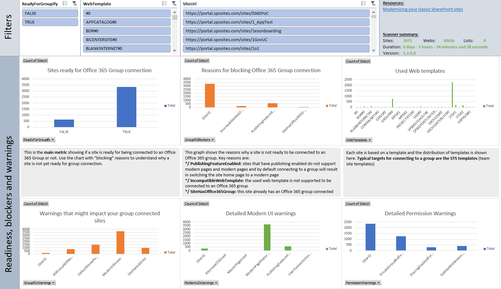
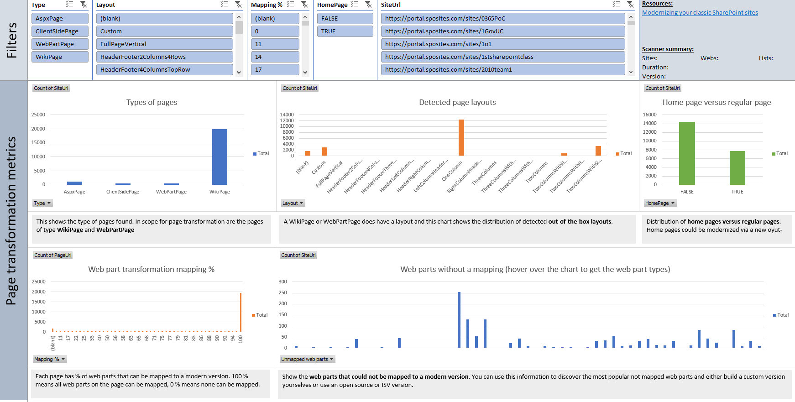
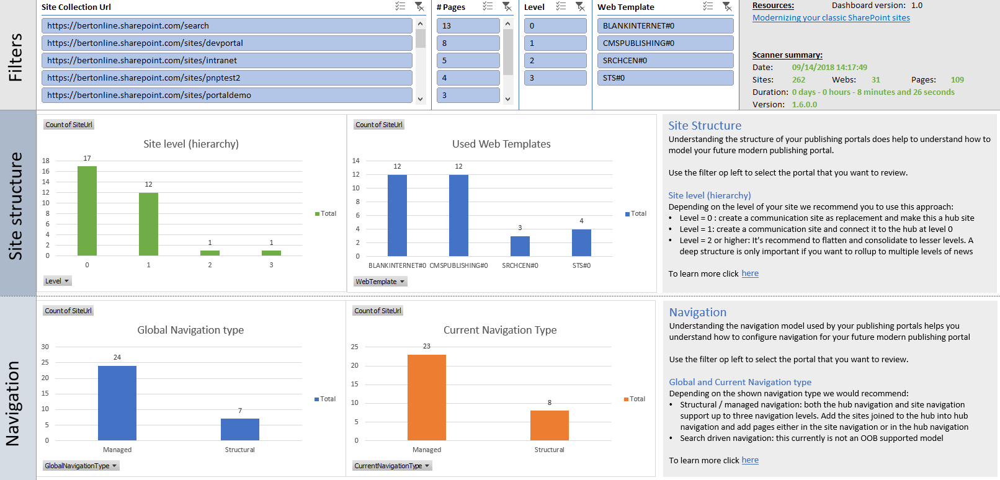
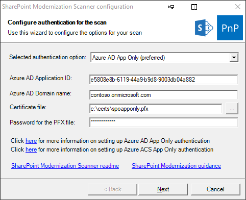

# SharePoint Modernization scanner #

### Summary ###

Using this scanner you can prepare your classic sites for modernization via connecting these sites to an Office 365 group (the "groupify" process), modernizing the pages and in case of a publishing portal designing a modern publishing portal. This scanner is a key tool to use if you want to prepare for modernizing your classic sites.

> **Important**
> Checkout the [Modernize your classic sites](https://docs.microsoft.com/en-us/sharepoint/dev/transform/modernize-classic-sites) article series on docs.microsoft.com to learn more about modernization. [Connect to an Office 365 group](https://docs.microsoft.com/en-us/sharepoint/dev/transform/modernize-connect-to-office365-group) and [Transform classic pages to modern client-side pages](https://docs.microsoft.com/en-us/sharepoint/dev/transform/modernize-userinterface-site-pages) are articles that refer to this scanner.

### Applies to ###

- SharePoint Online

### Solution ###

Solution | Author(s)
---------|----------
SharePoint.Modernization.Scanner | Bert Jansen (**Microsoft**)

### Version history ###

Version  | Date | Comments
---------| -----| --------
2.0 | October 15th 2018 | Built-in wizard will help you configure the scan parameters...you can forget about these long complex command lines!
1.7 | October 14th 2018 | Integrated SharePoint UI Experience scanner results + bug fixes
1.6 | September 25th 2018 | Added support for scanning classic Publishing Portals, simplified Group Connection dashboard, Compiled as X64 to avoid memory constraints during large scans
1.5 | June 1st 2018 | Added generation of Excel based reports which make it easier to consume the generated data
1.4 | May 5th 2018 | Added web part mapping percentage in page scan + by default raw web part data is not exported + allow to skip search query for site/page usage information
1.3 | March 16th 2018 | Added site usage information
1.2 | March 7th 2018 | Reliability improvements
1.1 | January 31st 2018 | Performance and stability improvements + Page scanner component integrated
1.0 | January 19th 2018 | First main version

### Disclaimer ###

**THIS CODE IS PROVIDED *AS IS* WITHOUT WARRANTY OF ANY KIND, EITHER EXPRESS OR IMPLIED, INCLUDING ANY IMPLIED WARRANTIES OF FITNESS FOR A PARTICULAR PURPOSE, MERCHANTABILITY, OR NON-INFRINGEMENT.**

----------

# What will this tool do for you? #

The main purpose of this tool is to give you a set of reports that you can use to:

- Assess which sites are ready for "groupify": this report will give you "groupify" warnings and blockers which you can use to scope the sites to "groupify" and plan the needed remediation work
- Understand which lists are not showing up in modern, why that's the case and what you can do about them
- Learn more about the site pages used in your tenant: knowing which pages you have and their characteristics (type, layout, web part data, usage) is important to prepare for modernizing (a subset of) these pages
- Perform a deep analysis on your classic publishing portals: understanding your classic publishing portals will help you transform them to modern publishing portals

**Group connection readiness** | **List readiness**
:---------|:----------
 | 
**Page transformation readiness** | **Publishing portal transformation**
 | 

# Quick start guide #

## Download the tool ##

You can download the tool from here:

- [Modernization scanner for SharePoint Online](https://github.com/SharePoint/PnP-Tools/blob/master/Solutions/SharePoint.Modernization/Releases/SharePoint.Modernization.Scanner%20v2.0.zip?raw=true)

Once you've downloaded the tool you have a folder containing the tool **SharePoint.Modernization.Scanner.exe**. Start a (PowerShell) command prompt and navigate to that folder so that you can use the tool.

> Note:
> If you want to compile the tool yourself you'll also need to have the SharePoint.Scanning solution available as this tools depends on the SharePoint Scanner framework to compile.

## Using the scanner for SharePoint Online ##

Since this tool needs to be able to scan all site collections it's recommended to use an app-only principal with tenant scoped permissions for the scan. This approach will ensure the tool has access, if you use an account (e.g. your SharePoint tenant admin account) then the tool can only access the sites where this user also has access. You can either use a an Azure AD application or a SharePoint app principal:

- [Granting access via Azure AD App-Only](https://docs.microsoft.com/en-us/sharepoint/dev/solution-guidance/security-apponly-azuread)
- [Granting access via SharePoint App-Only](https://docs.microsoft.com/en-us/sharepoint/dev/solution-guidance/security-apponly-azureacs)

Once the preparation work is done, let's continue with doing a scan.

### Scanning SharePoint Online environment ###

#### Using the built-in wizard

When you run the scanner executable without specifying command line parameters a wizard will show that walks you through the needed steps to collect scanner configuration data. Once all data has been collected the scan will be executed. This approach is the easiest if you don't like to configure a potential complex command line. Below is an image showing the wizard in action:



#### Using the command line

Below option is the default usage of the tool for most customers: you specify the mode, your tenant name and the created client id and secret:

```console
SharePoint.Modernization.Scanner.exe -t <tenant> -i <clientid> -s <clientsecret>
```

A real life sample:

```console
SharePoint.Modernization.Scanner.exe -t contoso -i 7a5c1615-997a-4059-a784-db2245ec7cc1 -s eOb6h+s805O/V3DOpd0dalec33Q6ShrHlSKkSra1FFw=
```

The above use will run all scanning options, but you can also target the scan via the `Mode` parameter (-m):

```console
SharePoint.Modernization.Scanner.exe -m <mode> -t <tenant> -i <clientid> -s <clientsecret>
```

A real life sample:

```console
SharePoint.Modernization.Scanner.exe -m GroupifyOnly -t contoso -i 7a5c1615-997a-4059-a784-db2245ec7cc1 -s eOb6h+s805O/V3DOpd0dalec33Q6ShrHlSKkSra1FFw=
```

#### Supported scanner modes ####

Mode | Description
-----|------------
`Full` | All components will be included, omitting -m has the same result
`GroupifyOnly` | Only use the Office 365 group connection readiness component, this component is part of each scan
`ListOnly` | Includes a deep list scan + includes the Office 365 group connection readiness component
`PageOnly` | Includes a scan from wiki and web part pages + includes the Office 365 group connection readiness component
`PublishingOnly` | Includes a classic publishing portal scan at site and web level + includes the Office 365 group connection readiness component
`PublishingWithPagesOnly` | Includes a classic publishing portal scan at site,web and page level + includes the Office 365 group connection readiness component

After the run you'll find a new sub folder (e.g. 636530041937506713) which contains the following files. Depending on the optional mode you specified you'll get more or less reports.

Report | Include in following modes | Content
---------|----------|----------
**Office 365 Group Connection Readiness.xlsx** | All modes | The report that summarizes the data you need to know to help with assessing the readiness for "Office 365 group connection" also called "Groupify". Checkout [Analyze and use the scanner data](https://docs.microsoft.com/en-us/sharepoint/dev/transform/modernize-connect-to-office365-group-scanner) to learn more on how to use the scanner results.
**office 365 List Readiness.xlsx** | Full, ListOnly | An Excel report using PowerQuery and PowerPivot to make it easier for to analyze the lists that will not render in modern.
**Office 365 Page Transformation Readiness.xlsx** | Full, PageOnly| The report that summarizes the data you need to know to help with assessing the readiness for "Page Transformation" (so transforming from classic pages into modern pages)
**Office 365 Publishing Portal Transformation Readiness.xlsx** | Full, PublishingOnly, PublishingWithPagesOnly | The report that summarizes the data you need to understand for transforming your classic publishing portals into modern publishing portals
**ModernizationSiteScanResults.csv** | All modes | The main "groupify" report contains one row per site collection explaining which sites are ready to "groupify" with which warnings. It will also tell which "groupify" blockers it found and provide extensive information on the applied permission model.
**ModernizationWebScanResults.csv** | All modes | Having sub sites is a potential "groupify" warning and this report contains "groupify" relevant information about each web. This information is also rolled up to the ModernizationSiteScanResults.csv report, so you only need this report if you want to get more details on the found warnings/blockers.
**ModernizationListScanResults.csv** | Full, ListOnly | Contains all lists which are not using the "modern" experience.
**ModernizationUserCustomActionScanResults.csv** | All modes | When a site is "Groupified" it will get a "modern" home page...and  user custom actions that embed script do not work on modern pages. This report contains all the site/web scoped user custom actions that do not work on modern pages. This information is also rolled up to the ModernizationSiteScanResults.csv report, so you only need this report if you want to get more details on the actual found user custom actions.
**PageScanResults.csv** | Full, PageOnly | Contains a row per page in the site pages library of the scanned sites. This contains a ton of details on the scanned page like type, used layout and detailed web part information.
**UniqueWebParts.csv** | Full, PageOnly | Contains a list of uniquely found web parts during the scan.
**ModernizationPublishingSiteScanResults.csv** | Full, PublishingOnly, PublishingWithPagesOnly | One row per publishing portal (= site collection) containing a summary of the found information
**ModernizationPublishingWebScanResults.csv** | Full, PublishingOnly, PublishingWithPagesOnly | One row per publishing portal web containing all information scoped at the web level
**ModernizationPublishingPageScanResults.csv** | Full, PublishingOnly, PublishingWithPagesOnly | One row per scanned publishing page, containing information (like page layout, web parts) per page
**Error.csv** | All modes | If the scan tool encountered errors then these are logged in this file.
**ScannerSummary.csv** | All modes | Logs the number of scanned site collections, webs and list. It will also contain information on scan duration and used scanner version.

# Report details #

## Understanding the ModernizationSiteScanResults.csv file ##

This report contains the following columns:

Column | Description
---------|----------
**Site Collection Url** | Url of the scanned site collection.
**Site Url** | Url of the scanned web.
**ReadyForGroupify** | Can this site be "groupified"? If value is FALSE then it's strongly discouraged to "groupify" this site collection.
**GroupifyBlockers** | Lists the found blocking issues which is either `SiteHasOffice365Group` (site is already "groupified"), `PublishingFeatureEnabled` (publishing features are enabled) or `IsTenantRootSite` (Site is tenant root site collection).
**GroupifyWarnings** | List of the found warnings: these indicate non optimal conditions for "groupifying" the site but these are not considered a blocker for "groupify". Following can be potential warnings: `PermissionWarnings` (There's one or more permission related warning), `SiteHasSubSites` (sub sites are discouraged in modern sites), `ModernUIIssues` (parts of the modern UI capability has been disabled or we've incompatible customizations) or `DefaultHomePageImpacted` ("groupify" will add a new modern home page which is too different from the default home page of the used web template).
**GroupMode** | Proposed group mode (private/public) based on the found security setup (presence of EveryOne claims).
**PermissionWarnings** | Consolidates permission related warnings. Following values can be shown: `ADGroupWillNotBeExpanded` (site uses AD groups which do not expand inside an Office 365 group), `SharingDisabledForSiteButGroupWillAllowExternalSharing` (External sharing was disabled for the SharePoint site, but an Office 365 group will by default allow external sharing) or `SubSiteWithBrokenPermissionInheritance` (site has sub sites with unique permissions).
**ModernHomePage** | Does the site have a modern home page or not: if not "groupify" will create a default modern home page. Use this indicator to assess which sites you still want to give your customized modern home page before running "groupify"
**ModernUIWarnings** | This is a collection of warnings indicating either some modern UI component was turned off or incompatible features/customizations have been detected. Possible values are `ModernPageFeatureDisabled` (modern pages are disabled for this site), `ModernListsBlockedAtSiteLevel` (modern UI for lists has been purposely been blocked at site collection level), `ModernListsBlockedAtWebLevel` (modern UI for lists has been purposely been blocked at web collection level), `MasterPageUsed` (a custom master page has been used), `AlternateCSSUsed` (alternate CSS was defined), `UserCustomActionUsed` (incompatible user custom actions have been found) and `PublishingFeatureEnabled` (publishing features are enabled).
**WebTemplate** | The web template used by the site.
**Office365GroupId** | If this site is already connected to an Office 365 group is shows the id if that group.
**MasterPage** | Was a custom master page used?
**AlternateCSS** | Was alternate CSS defined?
**UserCustomActions** | Are there incompatible user custom actions used?
**SubSites** | Does the site have sub sites?
**SubSitesWithBrokenPermissionInheritance** | Does the site have sub sites with unique permissions?
**ModernPageWebFeatureDisabled** | Was the modern page feature disabled for this site?
**ModernPageFeatureWasEnabledBySPO** | Was the modern page feature ever enabled by SPO (it was not enabled on all sites ,this allows you to check where it really was turned off versus never enabled in the first place)?
**ModernListSiteBlockingFeatureEnabled** | Was the modern UI for lists purposely blocked at site collection level?
**ModernListWebBlockingFeatureEnabled** | Was the modern UI for lists purposely blocked at web level?
**SitePublishingFeatureEnabled** | Is site scoped publishing feature enabled?
**WebPublishingFeatureEnabled** | Is web scoped publishing feature enabled?
**ViewsRecent** | Number of views this site received in the last 14 days. If the -c or skipusageinformation parameter was used this column is always 0.
**ViewsRecentUniqueUsers** | Number of unique visitors for this site in the last 14 days. If the -c or skipusageinformation parameter was used this column is always 0.
**ViewsLifeTime** | Number of views this site received during it's lifetime. If the -c or skipusageinformation parameter was used this column is always 0.
**ViewsLifeTimeUniqueUsers** | Number of unique visitors for this site during it's lifetime. If the -c or skipusageinformation parameter was used this column is always 0.
**Everyone(ExceptExternalUsers)Claim** | Is the `everyone` or `everyone except external users` claim used at site level?
**UsesADGroups** | Are there AD groups used to grant permissions?
**ExternalSharing** | Lists the external sharing status of the site
**Admins** | A comma delimited list of site administrators.
**AdminContainsEveryone(ExceptExternalUsers)Claim** | Is the `everyone` or `everyone except external users` claim used in the site administrators?
**AdminContainsADGroups** | Are there AD groups used in the site administrators?
**Owners** | A comma delimited list of site owners.
**OwnersContainsEveryone(ExceptExternalUsers)Claim** | Is the `everyone` or `everyone except external users` claim used in the site owners?
**OwnersContainsADGroups** | Are there AD groups used in the site owners?
**Members** | A comma delimited list of site members.
**MembersContainsEveryone(ExceptExternalUsers)Claim** | Is the `everyone` or `everyone except external users` claim used in the site members?
**MembersContainsADGroups** | Are there AD groups used in the site members?
**Visitors** | A comma delimited list of site visitors.
**VisitorsContainsEveryone(ExceptExternalUsers)Claim** | Is the `everyone` or `everyone except external users` claim used in the site viewers?
**VisitorsContainsADGroups** | Are there AD groups used in the site visitors?

### Key takeaways from this report ##

Load the ModernizationSiteScanResults.csv into Microsoft Excel and use below filters to analyze the received data

Filter | Takeaway
---------|----------
**No filter** | Will give you one row per site collection in your tenant
**ReadyForGroupify = TRUE** | Will give you all the site collections that can be "groupified". There might still be warnings to check, but we did not find any blocking issues
**ReadyForGroupify = FALSE AND Office365GroupId = ""** | Will give you all the sites which do not yet have an Office 365 group connected and which can't be groupified
**ReadyForGroupify = TRUE AND GroupMode = PUBLIC** | Will give you all the site collections that can be "groupified" and for which we'll default to a public group (based on the presence of the `everyone` or `everyone except external users` in the site members or site owners

## Understanding the ModernizationWebScanResults.csv file ##

This report contains the following columns:

Column | Description
---------|----------
**Site Collection Url** | Url of the scanned site collection.
**Site Url** | Url of the scanned web.
**WebTemplate** | The web template used by this web.
**BrokenPermissionInheritance** | Does this site have unique permissions defined?
**ModernPageWebFeatureDisabled** | Was the modern page feature disabled for this web?
**ModernPageFeatureWasEnabledBySPO** | Was the modern page feature ever enabled by SPO (it was not enabled on all sites ,this allows you to check where it really was turned off versus never enabled in the first place)?
**WebPublishingFeatureEnabled** | Is web scoped publishing feature enabled?
**MasterPage** | Value of the master page if customized
**CustomMasterPage** | Value of the custom master page if customized
**AlternateCSS** | Value of the alternate CSS if set
**UserCustomActions** | Are there incompatible user custom actions used in this web?
**Everyone(ExceptExternalUsers)Claim** | Is the `everyone` or `everyone except external users` claim used at web level?
**UniqueOwners** | Comma delimited list of owners if this web has unique permissions defined.
**UniqueMembers** | Comma delimited list of members if this web has unique permissions defined.
**UniqueVisitors** | Comma delimited list of visitors if this web has unique permissions defined.

### Key takeaways from this report ###

Load the ModernizationWebScanResults.csv into Microsoft Excel and use below filters to analyze the received data

Filter | Takeaway
---------|----------
**No filter** | Will give you one row per scanned web
**MasterPage <> "" OR CustomMasterPage <> ""** | Will give you the webs having a custom master page set and name of that custom master page
**AlternateCSS <> ""** | Will give you the webs having alternate CSS defined and the name of the configured alternate CSS file

## Understanding the ModernizationListScanResults.csv file ##

This report contains the following columns:

Column | Description
---------|----------
**List Url** | Url of the scanned object (list form page url in this case).
**Site Url** | Url of the scanned site.
**Site Collection Url** | Url of the scanned site collection.
**List Title** | Title of the list.
**Only blocked by OOB reaons** | TRUE if the list is **only** blocked due to reasons which you as customer cannot influence, being blocked due to unsupported list base template, unsupported list view type or unsupported field type being shown. Note that you can use the the **-k (-skiplistsonlyblockedbyoobreaons) parameter** to skip logging lists which are only blocked due to these reasons
**Blocked at site level** | TRUE if the list is blocked because the **site** scoped feature (E3540C7D-6BEA-403C-A224-1A12EAFEE4C4) was enabled.
**Blocked at web level** | TRUE if the list is blocked because the **web** scoped feature (52E14B6F-B1BB-4969-B89B-C4FAA56745EF) was enabled.
**Blocked at list level** | TRUE if the user changed the list experience setting to "classic experience".
**List page render type** | The value of the PageRenderType property as explained in [docs.microsoft.com](https://docs.microsoft.com/en-us/sharepoint/dev/solution-guidance/modern-experience-customizations-customize-lists-and-libraries#programmatically-detect-if-your-librarylist-will-be-shown-using-modern-or-classic).
**List experience** | The set list experience setting: auto (default), modern or classic. 
**Blocked by not being able to load page** | TRUE if the page associated with the list default view could not be loaded.
**Blocked by not being able to load page exception** | The error that was triggered when the page could not be loaded.
**Blocked by managed metadata navigation** | TRUE if the list is blocked because the web scoped metadata navigation (7201d6a4-a5d3-49a1-8c19-19c4bac6e668) feature was enabled. **Note:** Microsoft started rolling out support for managed metadata navigation in the "modern" list and library experience. See https://techcommunity.microsoft.com/t5/SharePoint-Blog/SharePoint-filters-pane-updates-filtering-and-metadata/ba-p/74162 for more details.
**Blocked by view type** | TRUE if the list default view is using a view type which cannot be shown in "modern".
**View type** | The used view type that is not working in "modern".
**Blocked by list base template** | TRUE if the list is blocked because it's based upon a list type which can't be shown in "modern".
**List base template** | Base template of the list. This base template can't be shown in "modern".
**Blocked by zero or multiple web parts** | TRUE if the the list default view page is having more than 1 web part.
**Blocked by JSLink** | TRUE if the the XSLT List View web part, which is showing the list data, has the JSLink property set.
**JSLink** | The JSLink property set on the XSLT List View web part.
**Blocked by XslLink** | TRUE if the XSLT List View web part, which is showing the list data, has the XslLink property set.
**XslLink** | The XslLink property set on the XSLT List View web part. 
**Blocked by Xsl** | TRUE if the XSLT List View web part, which is showing the list data, has the Xsl property set.
**Blocked by JSLink field** | TRUE if a list view field has the JSLink property set.
**JSLink fields** | Collection of fields with JSLink set.
**Blocked by business data field** | TRUE if a list view field is of the type "business data".
**Business data fields** | Collection of fields of type "business data".
**Blocked by task outcome field** | TRUE if a list view field is of the type "task outcome".
**Task outcome fields** | Collection of fields of type "task outcome".
**Blocked by publishingField** | TRUE if a list view field is of the type "publishing".
**Publishing fields** | Collection of fields of type "publishing".
**Blocked by geo location field** | TRUE if a list view field is of the type "geo location".
**Geo location fields** | Collection of fields of type "geo location".
**Blocked by list custom action** | TRUE if the list is having incompatible list scoped user custom actions. Incompatible user custom actions are having ScriptLink as location.
**List custom actions** | Collection of offending list custom action names.

### Key takeaways from this report
Load the ModernListBlocked.csv into Microsoft Excel and use below filters to analyze the received data

Filter | Takeaway
---------|----------
**No filter** | Will give you **all** the lists for which the default view page will not present itself using the "modern" UI. The number of lists can be very high because not all lists are designed to use the "modern" user interface. This data is however useful to assess the impact of upcoming "modern" changes: e.g. this report will tell you that x lists are not showing in modern because feature y is not available...if you know that feature y will become available in the future you can assess how many additional lists will then be able to present themselves using the "modern" user interface.
**Blocked at site level = TRUE or Blocked at web level = TRUE** | Using this filter you'll get all the sites where the "modern" ui blocking site/web scoped feature was enabled. It might be that this was done because certain sites were not yet ready for "modern", using this data you can disable the "modern" ui blocking feature again.
**Blocked at list level = TRUE** | End users do have the option to turn on/off the "modern" experience per list and using this filter you'll learn where that happened. The column "list experience" will show which setting was applied.
**Only blocked by OOB reaons = FALSE** | Will give you all the lists which are not rendering in "modern" because of a reason you can influence. If you want to improve the "modern" user interface compatibility of your SharePoint Online lists then these are the lists you can work with. 
**Only blocked by OOB reaons = FALSE and (Blocked by JSLink = TRUE or Blocked by XslLink = TRUE or Blocked by Xsl = TRUE or Blocked by JSLink field = TRUE)** | These are all the lists which are not showing in modern because their rendering is impacted by the existence of custom JavaScript or XSL. You could remove the references to these JavaScript and XSL files and go back to the out of the box way of list rendering or alternatively you can use column/view formatters or custom SharePoint Framework development.
**Only blocked by OOB reaons = FALSE and Blocked by list custom action = TRUE** | If a list custom action is embedding JavaScript then that will prevent rendering of the "modern" user interface. You can remove this list custom action or alternatively you can use column/view formatters or custom SharePoint Framework development.
**Business data fields = true or Blocked by task outcome field = true or Blocked by geo location field = true or Blocked by publishingField = true** | Although you can't fix the rendering of these fields you do have the option to remove them from the list default view which will fix the list "modern" rendering.

## Understanding the ModernizationUserCustomActionScanResults.csv file ##

This report contains the following columns:

Column | Description
---------|----------
**Site Collection Url** | Url of the scanned site collection.
**Site Url** | Url of the scanned web.
**Title** | User custom action title.
**Name** | Name of the user custom action.
**Location** | Location of the user custom action.
**RegistrationType** | Registration type of the user custom action.
**RegistrationId** | ID of the registration.
**Reason** | Reasons why this user custom action is ignored in "modern".
**ScriptBlock** | Value of the ScriptBlock user custom action value.
**ScriptSrc** | Value of the ScriptSrc user custom action value.

### Key takeaways from this report ###

Load the ModernizationUserCustomActionScanResults.csv into Microsoft Excel and use below filters to analyze the received data

Filter | Takeaway
---------|----------
**No filter** | Will give you one row per found incompatible user custom action. You need to assess how important these user custom actions are: if they are business critical it's better to either build an alternative [SharePoint Framework extension](https://docs.microsoft.com/en-us/sharepoint/dev/spfx/extensions/overview-extensions) or move the site back to "classic"

## Understanding the PageScanResults.csv file ##

This report contains the following columns:

Column | Description
---------|----------
**Site Collection Url** | Url of the scanned site collection.
**Site Url** | Url of the scanned web.
**PageUrl** | Server relative URL of the scanned page.
**Library** | Server relative URL of the pages library holding the scanned page.
**HomePage** | Is this a site's home page?.
**Type** | Type of the page (`WikiPage`, `WebPartPage`, `ClientSidePage` or `AspxPage`).
**Layout** | Standard layout of the found WikiPage or WebPartPage
**Mapping %** | Percentage of web parts on the page that have a mapping in the provided mapping file
**Unmapped web parts** | Web part types which were not mapped via the provided web part mapping file
**ModifiedBy** | Last person that modified this page.
**ModifiedAt** | Last modification date and time for this page.
**ViewsRecent** | Number of views this page received in the last 14 days. If the -c or skipusageinformation parameter was used this column is always 0.
**ViewsRecentUniqueUsers** | Number of unique visitors for this page in the last 14 days. If the -c or skipusageinformation parameter was used this column is always 0.
**ViewsLifeTime** | Number of views this page received during it's lifetime. If the -c or skipusageinformation parameter was used this column is always 0.
**ViewsLifeTimeUniqueUsers** | Number of unique visitors for this page during it's lifetime. If the -c or skipusageinformation parameter was used this column is always 0.
**WPType1-30** | Up to 30 columns indicating the web part type.
**WPTitle1-30** | Up to 30 columns indicating the web part title.
**WPData1-30** | Up to 30 columns holding the exported web part data (see upcoming chapter for details), only if the -b or exportwebpartproperties parameter was specified

### Key takeaways from this report ###

Load the PageScanResults.csv into Microsoft Excel and use below filters to analyze the received data

Filter | Takeaway
---------|----------
**No filter** | Will give you one row per scanned page
**HomePage = TRUE** | Gives you all the site home pages
**Type = "WebPartPage"** | Gives you all the web part pages
**ViewsRecent > 0** | Pages which have been recently accessed

### WPData details (if the -b or exportwebpartproperties parameter was specified) ###

For each exported web part the same base JSON structure is used as shown below. Important to note are:

- The "Row" property indicates the row (=section) this web part should be added into in a new client side page (assuming the layout of the original page was detected)
- The "Column" property indicates the column this web part should be added into in a new client side page (assuming the layout of the original page was detected)
- The "Properties" property holds the web part specific properties

```JSON
{
	"Type":"<fully qualified web part type>",
	"Id":"6f930c6f-b7d5-44db-b6e7-55d375e4667d",
	"ServerControlId":"6f930c6f-b7d5-44db-b6e7-55d375e4667d",
	"ZoneId":"FullPage",
	"Hidden":false,
	"IsClosed":false,
	"Title":"<web part title>",
	"Row":1,
	"Column":1,
	"Order":0,
	"ZoneIndex":0,
	"Properties":{"<web part specific properties>"}
}
```

Since each web part has different **relevant** properties the properties that are exported for a web part are defined in the `webpartmapping.xml` file: this allows you to add/remove properties based on your needs. Each defined property is exported and stored underneath the "Properties" property as shown in below complete example:

```JSON
{
	"Type":"Microsoft.Office.Visio.Server.WebControls.VisioWebAccess, Microsoft.Office.Visio.Server, Version=16.0.0.0, Culture=neutral, PublicKeyToken=71e9bce111e9429c",
	"Id":"6f930c6f-b7d5-44db-b6e7-55d375e4667d",
	"ServerControlId":"6f930c6f-b7d5-44db-b6e7-55d375e4667d",
	"ZoneId":"FullPage",
	"Hidden":false,
	"IsClosed":false,
	"Title":"Visio Web Access",
	"Row":1,
	"Column":1,
	"Order":0,
	"ZoneIndex":0,
	"Properties":
	{
		"Title":"Visio Web Access",
		"Description":"Enables viewing and refreshing of Visio Web Drawings.", 
		"Width":"", 
		"Height":"400px", 
		"ShapeDataNames":"", 
		"ShowBackground":"True", 
		"ShowShapeInfoButton":"True", 
		"ShowPageNavigation":"True", 
		"DisableSelection":"False", 
		"FitViewToShapes":"False", 
		"AlwaysRaster":"False", 
		"AutoRefreshInterval":"0", 
		"ShowRefresh":"True", 
		"DiagramPath":"/sites/espctest1/Shared Documents/Drawing1.vsdx", 
		"OverrideViewSettings":"True", 
		"ShowZoomControl":"True", 
		"ViewSettings":"", 
		"DisableZoom":"False", 
		"DefaultPageShown":"1", 
		"ShowOpenInVisio":"True", 
		"DisableHyperlink":"False"
	}
}
```

## Understanding the UniqueWebParts.csv file ##

This report contains the following columns:

Column | Description
---------|----------
**Type** | Fully qualified name of the web part.
**InMappingFile** | Indicates if this web part is listed in the webpartmapping file.

### Key takeaways from this report ###

Load the UniqueWebParts.csv into Microsoft Excel and use below filters to analyze the received data

Filter | Takeaway
---------|----------
**No filter** | Will give you one row per uniquely detected web part
**InMappingFile = FALSE** | Gives you all the web parts which are not part of the webpartmapping.xml file. If these are important for you it's best to define these web parts with the properties you want to retrieve

## Understanding the ModernizationPublishingSiteScanResults.csv file ##

This report contains the following columns:

Column | Description
---------|----------
**Site Collection Url** | Url of the scanned site collection.
**Number Of Webs** | Number of webs counted in this publishing portal site collection
**Number of Pages** | Total count of the publishing pages in this portal site collection
**UsedSiteMasterPages** |  Delimited list of custom site master pages used in the site collection
**UsedSystemMasterPages** | Delimited list of custom system master pages used in the site collection
**UsedPageLayouts** | Delimited list of page layouts used in the site collection
**LastPageUpdateDate** | Most recent page modification date

### Key takeaways from this report ###

Load the ModernizationPublishingSiteScanResults.csv into Microsoft Excel and use below filters to analyze the received data

Filter | Takeaway
---------|----------
**No filter** | Helps you identify the bigger (and often more complex) portals in your environment
**LastPageUpdate < TODAY -365** | Helps you identify stale publishing portals, which probably don't require modernization

## Understanding the ModernizationPublishingWebScanResults.csv file ##

This report contains the following columns:

Column | Description
---------|----------
**Site Collection Url** | Url of the scanned site collection.
**SiteUrl** | Url of the scanned web
**WebRelativeUrl** | Relative url of the web
**WebTemplate** | Template used to create this web
**Level** | Level of depth of the web, 0 is top level
**PageCount** | Number of publishing pages that exist in this web
**Language** | The language this web was created in
**VariationLabels** | The variation labels assigned to this site collection (if any)
**VariationSourceLabel** | The variation label assigned to this web (if any)
**SiteMasterPage** | The site master page in case it was a custom one
**SystemMasterPage** | The system master page in case it was a custom one
**AlternateCSS** | The alternate CSS value
**AllowedPageLayouts** | A list of allowed page layouts in case only a subset of page layouts was allowed for this site
**PageLayoutsConfiguration** | Configuration of how page layouts are setup (`Any`, `Inherit from parent` or `Define list`)
**DefaultPageLayout** | The default page layout that will be used for a new article in this site
**GlobalNavigationType** | Global navigation configuration (`Structural` or `Managed`)
**GlobalStructuralNavigationShowSubSites** | Show sub sites in global navigation if structural navigation was configured
**GlobalStructuralNavigationShowPages** | Show pages in global navigation if structural navigation was configured
**GlobalStructuralNavigationShowSiblings** | Show siblings in global navigation if structural navigation was configured
**GlobalStructuralNavigationMaxCount** | Maximum number of menu items in global navigation if structural navigation was configured
**GlobalManagedNavigationTermSetId** | ID of the term set holding the navigation nodes if global managed navigation was configured
**CurrentNavigationType** | Current navigation configuration (`Structural` or `Managed`)
**CurrentStructuralNavigationShowSubSites** | Show sub sites in current navigation if structural navigation was configured
**CurrentStructuralNavigationShowPages** | Show pages in current navigation if structural navigation was configured
**CurrentStructuralNavigationShowSiblings** | Show siblings in current navigation if structural navigation was configured
**CurrentStructuralNavigationMaxCount** | Maximum number of menu items in current navigation if structural navigation was configured
**CurrentManagedNavigationTermSetId** | ID of the term set holding the navigation nodes if current managed navigation was configured
**ManagedNavigationAddNewPages** | Add pages to navigation if managed navigation was chosen
**ManagedNavigationCreateFriendlyUrls** | Create friendly urls if managed navigation was chosen
**LibraryItemScheduling** | Has the pages library scheduled item publishing setup?
**LibraryEnableModeration** | Has the pages library moderation (=basic approval) setup?
**LibraryEnableVersioning** | Has the pages library major version versioning setup?
**LibraryEnableMinorVersions** | Has the pages library minor version versioning setup?
**LibraryApprovalWorkflowDefined** | Has the pages library an approval workflow setup?
**BrokenPermissionInheritance** | Has this site broken permission inheritance?
**Admins** | The list of admins for this web
**Owners** | The list of owners for this web

### Key takeaways from this report ###

Load the ModernizationPublishingWebScanResults.csv into Microsoft Excel and use below filters to analyze the received data

Filter | Takeaway
---------|----------
**No filter** | Gives you a quick overview of the webs in this publishing portal and their key statistics like page count and level
**Level >= 2** | Webs at a level of 2 or higher do not fit in the current hub model

## Understanding the ModernizationPublishingPageScanResults.csv file ##

This report contains the following columns:

Column | Description
---------|----------
**Site Collection Url** | Url of the scanned site collection.
**SiteUrl** | Url of the scanned web
**WebRelativeUrl** | Relative url of the web
**PageRelativeUrl** | Relative url of the page
**PageName** | Name of the page
**ContentType**  | Name of the used content type
**ContentTypeId** | ID of the used content type
**PageLayout** | Name of the used page layout
**PageLayoutFile** | Filename of the used page layout
**GlobalAudiences** | Delimited list of global audiences defined on this page
**SecurityGroupAudiences** | Delimited list of security group audiences defined on this page
**SharePointGroupAudiences** | Delimited list of SharePoint group audiences defined on this page
**ModifiedAt** | Page was last modified at
**ModifiedBy** | Page was last modified by
**Mapping %** | If the page contains web parts this will list how good the web parts could be transformed to modern web parts
**WPType1-20** | Type of the found web part for up to 20 web parts
**WPTitle1-20** | Title of the found web part for up to 20 web parts

### Key takeaways from this report ###

Load the ModernizationPublishingPageScanResults.csv into Microsoft Excel and use below filters to analyze the received data

Filter | Takeaway
---------|----------
**No filter** | Understand used content types, page layouts and audiences
**ModifiedAt < TODAY-365** | These pages are stale and possibly can be 'skipped' during page modernization

# Advanced topics #

## I only want to scan a few sites, can I do that? ##
Using the urls command line switch you can control which sites are scanned. You can specify one or more url's which can have a wild card. Samples of valid url's are:

 - https://contoso.sharepoint.com/sites/portals*
 - https://contoso.sharepoint.com/sites/hrportal
 - https://contoso-my.sharepoint.com/personal/*

To specify the url's you can use the -r parameter as shown below:

```console
SharePoint.Modernization.Scanner -r https://contoso.sharepoint.com/sites/portals*,https://contoso.sharepoint.com/sites/hrportal,https://contoso-my.sharepoint.com/personal/* 
                                 -i 7a5c1615-997a-4059-a784-db2245ec7cc1 
                                 -s eOb6h+s805O/V3DOpd0dalec33Q6ShrHlSKkSra1FFw=
```

An alternative model is specifying the url's inside a CSV file and then using the -f parameter as shown below:

```console
SharePoint.Modernization.Scanner -v "c:\temp\files.csv" 
                                 -i 7a5c1615-997a-4059-a784-db2245ec7cc1 
                                 -s eOb6h+s805O/V3DOpd0dalec33Q6ShrHlSKkSra1FFw=
```

A sample file would look like this:

```console
https://contoso.sharepoint.com
https://contoso.sharepoint.com/sites/test1
https://contoso.sharepoint.com/sites/test2
```

## Can I generate the Excel reports for existing scan data? ##

You can do this by specifying the folder(s) with already existing scan data using the -g parameter. The scanner will concatenate the data from all passed folders and will generate the needed reports. The "Page transformation Readiness" report will only be generated if the relevant data is available.

```console
SharePoint.Modernization.Scanner -g <paths>

SharePoint.Modernization.Scanner -g "c:\temp\636529695601669598,c:\temp\636529695601698765"
```

## I'm running SharePoint with vanity URL's (SharePoint Online Dedicated), is this different? ##

In SharePoint Online Dedicated one can have vanity url's like teams.contoso.com which implies that the tool cannot automatically determine the used url's and tenant admin center url. Using below command line switches you can specify the site url's to scan and the tenant admin center url. Note that the urls need to be separated by a comma.

```console
SharePoint.Modernization.Scanner -a <tenantadminsite> -r <wildcard urls> -i <clientid> -s <clientsecret>
```

A real life sample:

```console
SharePoint.Modernization.Scanner -a https://contoso-admin.contoso.com 
                                 -r "https://teams.contoso.com/sites/*,https://portal.contoso.com/*"
                                 -i 7a5c1615-997a-4059-a784-db2245ec7cc1 -s eOb6h+s805O/V3DOpd0dalec33Q6ShrHlSKkSra1FFw=
```

## I want to use an Azure AD app to authenticate, how do I that? ##

This scanner, like all scanners built using the SharePoint Scanner framework, do support Azure AD App-Only:

```console
SharePoint.Modernization.Scanner -t <tenant> -i <Azure App ID> -z <Azure AD Domain> 
                                 -f "<Path to PFX file holding your certificate" -x <Password for the PFX file>
```

A real life sample:

```console
SharePoint.Modernization.Scanner -t contoso -i e4108e9b-9865-44a9-c6e1-9003db04a775 -z contoso.onmicrosoft.com  
                                 -f "C:\scanning\AzureADAppOnlyScanning.pfx" -x pwd
```

## I don't want to use app-only, can I use credentials? ##

The best option is to use app-only since that will ensure that the tool can read all site collections but you can also run the tool using credentials.

```console
SharePoint.Modernization.Scanner -m GroupifyOnly -t <tenant> -u <user> -p <password>

SharePoint.Modernization.Scanner -t <tenant> -u <user> -p <password>
```

A real life sample:

```console
SharePoint.Modernization.Scanner -m GroupifyOnly -t contoso -c admin@contoso.onmicrosoft.com -p mypassword

SharePoint.Modernization.Scanner -t contoso -c admin@contoso.onmicrosoft.com -p mypassword
```

# Complete list of command line switches for the SharePoint Online version #

```Console
SharePoint PnP Modernization scanner 1.7.0.0
Copyright (C) 2018 SharePoint PnP
==========================================================

See the PnP-Tools repo for more information at:
https://github.com/SharePoint/PnP-Tools/tree/master/Solutions/SharePoint.Modernization.Scanner

Let the tool figure out your urls (works only for SPO MT):
==========================================================
Using Azure AD app-only:
SharePoint.Modernization.Scanner.exe -t <tenant> -i <your client id> -z <Azure AD domain> -f <PFX file> -x <PFX file
password>
e.g. SharePoint.Modernization.Scanner.exe -t contoso -i e5808e8b-6119-44a9-b9d8-9003db04a882 -z conto.onmicrosoft.com
-f apponlycert.pfx -x pwd

Using app-only:
SharePoint.Modernization.Scanner.exe -t <tenant> -i <your client id> -s <your client secret>
e.g. SharePoint.Modernization.Scanner.exe -t contoso -i 7a5c1615-997a-4059-a784-db2245ec7cc1 -s
eOb6h+s805O/V3DOpd0dalec33Q6ShrHlSKkSra1FFw=

Using credentials:
SharePoint.Modernization.Scanner.exe -t <tenant> -u <your user id> -p <your user password>

e.g. SharePoint.Modernization.Scanner.exe -t contoso -u spadmin@contoso.onmicrosoft.com -p pwd

Specifying url to your sites and tenant admin (needed for SPO Dedicated):
=========================================================================
Using Azure AD app-only:
SharePoint.Modernization.Scanner.exe -r <wildcard urls> -a <tenant admin site>  -i <your client id> -z <Azure AD
domain> -f <PFX file> -x <PFX file password>
e.g. SharePoint.Modernization.Scanner.exe -r "https://teams.contoso.com/sites/*,https://my.contoso.com/personal/*" -a
https://contoso-admin.contoso.com -i e5808e8b-6119-44a9-b9d8-9003db04a882 -z conto.onmicrosoft.com  -f apponlycert.pfx
-x pwd

Using app-only:
SharePoint.Modernization.Scanner.exe -r <wildcard urls> -a <tenant admin site> -i <your client id> -s <your client
secret>
e.g. SharePoint.Modernization.Scanner.exe -r "https://teams.contoso.com/sites/*,https://my.contoso.com/personal/*" -a
https://contoso-admin.contoso.com -i 7a5c1615-997a-4059-a784-db2245ec7cc1 -s
eOb6h+s805O/V3DOpd0dalec33Q6ShrHlSKkSra1FFw=

Using credentials:
SharePoint.Modernization.Scanner.exe -r <wildcard urls> -a <tenant admin site> -u <your user id> -p <your user
password>
e.g. SharePoint.Modernization.Scanner.exe -r "https://teams.contoso.com/sites/*,https://my.contoso.com/personal/*" -a
https://contoso-admin.contoso.com -u spadmin@contoso.com -p pwd


  -m, --mode                               (Default: Full) Execution mode. Use following modes: full, GroupifyOnly,
                                           ListOnly, PageOnly, PublishingOnly, PublishingWithPagesOnly. Omit or use full for a
                                           full scan

  -b, --exportwebpartproperties            (Default: False) Export the web part property data

  -c, --skipusageinformation               (Default: False) Don't use search to get the site/page usage information and
                                           don't export that data

  -j, --skipuserinformation                (Default: False) Don't include user information in the exported data

  -k, --skiplistsonlyblockedbyoobreaons    (Default: False) Exclude lists which are blocked due to out of the box
                                           reasons: base template, view type of field type

  -d, --skipreport                         (Default: False) Don't generate an Excel report for the found data

  -g, --exportpaths                        List of paths (e.g. c:\temp\636529695601669598,c:\temp\636529695601656430)
                                           containing scan results you want to add to the report

  -i, --clientid                           Client ID of the app-only principal used to scan your site collections

  -s, --clientsecret                       Client Secret of the app-only principal used to scan your site collections

  -u, --user                               User id used to scan/enumerate your site collections

  -p, --password                           Password of the user used to scan/enumerate your site collections

  -z, --azuretenant                        Azure tenant (e.g. contoso.microsoftonline.com)

  -f, --certificatepfx                     Path + name of the pfx file holding the certificate to authenticate

  -x, --certificatepfxpassword             Password of the pfx file holding the certificate to authenticate

  -a, --tenantadminsite                    Url to your tenant admin site (e.g. https://contoso-admin.contoso.com): only
                                           needed when your not using SPO MT

  -t, --tenant                             Tenant name, e.g. contoso when your sites are under
                                           https://contoso.sharepoint.com/sites. This is the recommended model for
                                           SharePoint Online MT as this way all site collections will be scanned

  -r, --urls                               List of (wildcard) urls (e.g.
                                           https://contoso.sharepoint.com/*,https://contoso-my.sharepoint.com,https://co

                                           ntoso-my.sharepoint.com/personal/*) that you want to get scanned

  -o, --includeod4b                        (Default: False) Include OD4B sites in the scan

  -v, --csvfile                            CSV file name (e.g. input.csv) which contains the list of site collection
                                           urls that you want to scan

  -h, --threads                            (Default: 10) Number of parallel threads, maximum = 100

  -e, --separator                          (Default: ,) Separator used in output CSV files (e.g. ";")

  --help                                   Display this help screen.
```

